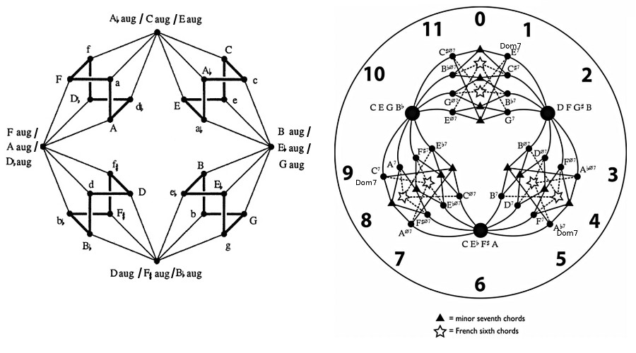

---

# Chord Cartography

Dan Nielsen 4/2019

### (The previous article in this series is [Structure of Scales](../the-structure-of-scales))

## JUST NOTES FOR MYSELF - Outline of a harmonic navigation system

* Affirm the conventional wisdom about seventh chords - that the major, minor, and fully diminished sevenths chords respectively extend the major, minor, and diminished triads.

* Make a map of all seventh chords constructed on the degrees of our 12 canonical scales, the idea being that identical chord types might be used to pivot-modulate between modes.

* Find and enumerate canonical cadences in each mode, while using our voice-leading map, to understand possible closing cadences and pivot modulations.

* Identify "negative" scales for each of our canonical scales, this being another form of modal transition alongside modulation and "tonic floating".

* Substitution (like iii7 for I7, which share 3 notes)

* Modal mixture

* Special harmonic progression: sad I-to-iii in a major key

## Negative scales

Negative harmony is a very popular concept in current music theory. Let's not elaborate here on its definition, since it's well-described by online resources. Suffice it to say that the "negative scale" begins on the fifth of the source scale and descends by the same order of whole and half steps, so that, for instance, [A B C D E F G] -> [E D C# B A G# F#]. We then reorder the result to begin with the original tonic, so it becomes, in this case, [A B C# D E F# G#], or the major scale.

But there's seemingly no good reason we shouldn't give the same significance to the symmetrical operation, to map a descending scale to an ascending scale that begins down a fifth, so that [A G F E D C B] -> [D E F# G A B C]. After recentering and reordering, this becomes [A B C D E F# G], or Dorian mode.

Notice that this process is a sort of natural continuation of the thinking in "Structure of Scales", where we attached harmonic structure to a nucleus of up-a-fifth-and-down-a-fifth. Now we are attaching serial pitch structure to up-a-fifth-and-down-a-fifth.

In the chart below, when a scale may be called by various names, the names are listed and separated by commas. The term "unharmonic" is used when a leading tone is flattened, and "unmystic" when a minor second is sharpened.

By negative harmony, we've shone light on eight more scales: **Lydian**, **Locrian**, **Lydian Diminished**, **Locrian Natural 6**, **Ukrainian Dorian**, **Dorian Flat 5**, **the Overtone scale**, **the Half-Diminished scale**.

Notice that we now nicely have all seven diatonic modes: Aeolian, Locrian, Ionian, etc.

We also have all of what I'm calling "harmonic" and "mystic" variants of these modes, except for two: MysLyd, HarLoc. These two scales are extremely uncommon in music, and, since they were not generated by our current musical operations, let's continue to leave them outside the scope of our scheme.

|        | Neg1 | Neg2 |
| :----: | :----: | :----: |
| 
**MF6**
 | 
HarDor, MelMinAsc
 | MysDor |
| 
Har
   | 
HarAeo, HarMin
   | **LocNat6** |
| 
Mys
   | **LydDim** | MysMix, HarMinInv |
| 
**Mix**
 | 
Dor
    | 
MysAeo, Phr
 |
| 
Har
   | 
Aeo, NatMin, MelMinDes
    | 
**Loc**
 |
| 
Mys
   | **UkrDor, RomMin** | MysMF6, PhrDom, Freygish |
| 
**Aeo**
 | 
HarMix, Ion, Maj
 | 
Dor
    |
| 
Har
   | HarMF6, HarMaj | **DorFlt5** |
| 
Mys
   |  
**Lyd**
    | 
Mix
    |
| 
**Dor**
 | 
Mix
    | 
Aeo, NatMin
    |
| 
Har
   | 
MF6
    | **UnmysLoc, HalfDim** |
| 
Mys
   |  **UnharLyd, Overtone** | 
MF6
    |

## Scale spectrum

In "Structure of Scales", a metric was given for the brightness of a scale based on its harmonic structure. Let's use that metric to order these scales by brightness.

We need to extend the metric a little, because, for the original set of scales, all "prongs" were attached to a "nucleus" of tonic and a fifth in either direction. This time, we might also have prongs attached at a distance of two fifths.

For an upward prong attached at a distance of two fifths, the associated interval is the augmented fourth. If tonic is G, then it's C# attached to A. If we consider A to have pitch 9/8, then the value will be 3(8/9), or about 2.667.

For a downward prong, the associated interval is the diminished fifth. If tonic is G, then it's Db attached to F. If we consider F to have pitch 8/9, then the value will be -3(9/8), or -3.375.

Of course, we haven't given any rigorous proof for this heuristic, but it seems to work well enough for the  purposes of ranking, even if it likely has issues.

    WITH G AS TONIC...                                                             
                                                                                   
    LYDIAN (w w w h w w h)                LOCRIAN (h w w h w w w)                  
                                                                                   
    B      F#     C#                      Bb ---- F ---- C ---- G                  
    |      |      |                               |      |      |                  
    G ---- D ---- A ---- E                        Db     Ab     Eb                 
                                                                                   
    3+2+2.667 = 7.667                     -2-3-3.375 = -8.375                      
                                                                                   
    LYDIAN DIMINISHED (w h 3h h w w h)    LOCRIAN NATURAL 6 (h w w h 3h h w)       
                                                                                   
           F#     C#                                     E                         
           |      |                                      |                         
    G ---- D ---- A ---- E                Bb ---- F ---- C ---- G                  
           |                                      |      |                         
           Bb                                     Db     Ab                        
                                                                                   
    2+2.667-3 = 1.667                     2-3-3.375 = -4.375                       
                                                                                   
    UKRAINIAN DORIAN (w h 3h h w h w)     DORIAN FLAT 5 (w h w h 3h h w)           
                                                                                   
                  C#                               A      E                        
                  |                                |      |                        
    G ---- D ---- A ---- E                 Bb ---- F ---- C ---- G                 
           |      |                                |                               
           Bb     F                                Db                              
                                                                                   
    2.667-3-3.375 = -3.708                2+2.667-3.375 = 1.292                    
                                                                                   
    OVERTONE SCALE (w w w h w h w)        HALF-DIMINISHED SCALE (w h w h w w w)    
                                                                                   
    B             C#                              A                                
    |             |                               |                                
    G ---- D ---- A ---- E                Bb ---- F ---- C ---- G                  
                  |                               |             |                         
                  F                               Db            Eb                        
                                                                                   
    3+2.667-3.375 = 2.292                 2.667-2-3.375 = -2.708                   

| Scale | Brightness |
| :---- | :---- |
| Lyd | 7.667 |
| HarMix, Ion, Maj | 7 |
| Mix | 5 |
| HarMF6, HarMaj | 3 |
| UnharLyd, Overtone | 2.292 |
| MysMix, HarMinInv | 2 |
| LydDim | 1.667 |
| DorFlt5 | 1.292 |
| MF6 | 1 |
| HarDor, MelMinAsc | 1 |
| Dor | -1 |
| MysMF6, PhrDom, Freygish | -2 |
| UnmysLoc, HalfDim | -2.708 |
| HarAeo, HarMin | -3 |
| UkrDor, RomMin | -3.708 |
| MysDor | -4 |
| LocNat6 | -4.375 |
| Aeo, NatMin, MelMinDes | -5 |
| MysAeo, Phr | -8 |
| Loc | -8.375 |

## Seventh chords taken as prescribed

This section simply affirms the conventional wisdom regarding seventh chords as extensions of triads.

Taking stacks of thirds, we can form seven seventh chords: **augmented**, **major**, **dominant**, **minor-major**, **minor**, **half-diminished**, **diminished**.

Since the augmented triad appears as a root triad only in the augmented seventh chord, we can think of both chords as **harmonically equivalent** in traditional harmony, with the seventh being an embellishment of the triad.

But the story's not so simple for the other seventh-chord types. The minor, major, and diminished triads each appear in two types of seventh chords. We might directly associate the major triad with the major seventh chord, the minor triad with the minor seventh chord, and the diminished triad with the fully diminished seventh chord. But besides the matching monikers already given to these chords, what's the justification?

Using traditional theory to "naturally" extend triads, we could argue against the candidacy of **minor-major**, **dominant**, and **half-diminished** as alternative interpretations...

* **Minor-major**:
This chord sounds tense and therefore does not provide a calm minor resolution, since the leading tone of harmonic minor wants to move up (nevermind the fact that it also appears in the major seventh chord, I guess); instead, it seems desirable that a so-called minor seventh interval (not a major interval) would extend a minor triad.

* **Dominant**:
This chord sounds like it wants to resolve down by a fifth, according to traditional theory, and therefore doesn't usually provide a stable major resolution; instead, it seems desirable that a so-called major seventh interval (not a minor interval) would extend a major triad.

* **Half-diminished**:
This chord does not fully contain the diminished character, which is minor thirds dividing the octave into four equal parts; instead, it seems desirable that a so-called diminished seventh interval (not a minor interval) would extend a diminished triad.

It seems these general conclusions are acceptable. Regarding the dominant seventh, we could amend that only a half-step modification is required to reach either a minor seventh chord or a major seventh chord; likewise, we could simply move away from the seventh, leaving the major triad. Therefore, taken without the context of a major scale, the dominant seventh is not necessarily so filled with the need to resolve down by a fifth, especially when doubling octaves of the root note. When the dominant seventh chord is viewed as an approximation of the first 8 harmonics, empowering the root tone is like restoring the harmonics 1:2:4:8.

However, the major seventh contains two major thirds, on both the tonic and the fifth, so it makes sense to consider it the truest extension of the major triad.

## Scales of six and eight tones

## Pivot-chord modulation

The previous article mentioned "secret passages", pairs of modes with a perfect-fifth relationship that share exactly the same harmonic structure, with only a different choice of tonic placement in the harmonic lattice. My interpretation is this: whereas we are used to thinking of a dominant relationship as being a heavy one, seeking resolution in the initial tonic, this perfect-fifth relation is weightless, and tonic can tranquilly float between either mode.

But let's consider more traditional modulation now. The politest form of this modulation employs a pivot chord, meaning a chord that has a harmonic function in both the progressions of the original key and the target key.

The table below gives us the seventh chord built on each scale degree in our new set of canonical scales.

Just for example, it shows that we could pivot from MF6 into HarDor when we consider VIIV7 in MF6 to be VV7 in HarDor.

|        |        |        |        |        |        |        |
| :----: | :----: | :----: | :----: | :----: | :----: | :----: |
| 
**I+7**
 | 
**I7**
 | 
**IV7**
 | 
**imM7**
 | 
**i7**
 | 
**i&#x03d5;7**
 | 
**io7**
 |
|        | HarMix | Mix    | HarAeo | Aeo    | Loc    |        |
|        | HarMF6 | MF6    | HarDor | Dor    | LocNat6|        |
|        | Lyd    | MysMix | LydDim | MysAeo | DorFlt5|        |
|        |        | MysMF6 |        | MysDor | UnmysLoc|       |
|        |        | UnharLyd|       | UkrDor |        |        |
| 
**II+7**
 | 
**II7**
 | 
**IIV7**
 | 
**iimM7**
 | 
**ii7**
 | 
**ii&#x03d5;7**
 | 
**iio7**
 |
| MysMix | MysMF6 | Lyd    |        | Mix    | MF6    |        |
| MysDor | MysAeo | LydDim |        | Dor    | Aeo    |        |
| LocNat6| Loc    | UkrDor |        | HarMix | HarMF6 |        |
|        |        | UnharLyd|       | HarDor | HarAeo |        |
|        |        |        |        | DorFlt5| UnmysLoc|       |
| 
**III+7**
 | 
**III7**
 | 
**IIIV7**
 | 
**iiimM7**
 | 
**iii7**
 | 
**iii&#x03d5;7**
 | 
**iiio7**
 |
| HarAeo | Aeo    | MysAeo | DorFlt5| HarMix | Mix    | MysMix |
| HarDor | Dor    | MysDor | UnmysLoc| HarMF6 | MF6    | MysMF6 |
| LydDim | UkrDor |        |        | Lyd    | UnharLyd|       |
|        |        |        |        | Loc    |        |        |
|        |        |        |        | LocNat6|        |        |
| 
**IV+7**
 | 
**IV7**
 | 
**IVV7**
 | 
**ivmM7**
 | 
**iv7**
 | 
**iv&#x03d5;7**
 | 
**ivo7**
 |
|        | Mix    | Dor    | MF6    | Aeo    | Lyd    | LydDim |
|        | MysMix | MysDor | MysMF6 | MysAeo | UnharLyd| UkrDor |
|        | HarMix | HarDor | HarMF6 | HarAeo |        |        |
|        |        | LocNat6|        | Loc    |        |        |
|        |        | DorFlt5|        | UnmysLoc|        |        |
| 
**AugV+7**
 | 
**MajV7**
 | 
**VV7**
 | 
**vmM7**
 | 
**v7**
 | 
**v&#x03d5;7**
 | 
**vo7**
 |
| DorFlt5| Lyd    | HarMix | UkrDor | Mix    | MysMix |        |
| UnmysLoc|Loc    | HarMF6 | UnharLyd| MF6    | MysMF6 |        |
|        | LydDim | HarAeo |        | Aeo    | MysAeo |        |
|        | LocNat6| HarDor |        | Dor    | MysDor |        |
| 
**VI+7**
 | 
**VI7**
 | 
**VIV7**
 | 
**vimM7**
 | 
**vi7**
 | 
**vi&#x03d5;7**
 | 
**vio7**
 |
| MF6    | Aeo    | Loc    |        | Mix    | Dor    | LocNat6|
| MysMF6 | MysAeo | UnmysLoc|       | MysMix | MysDor | DorFlt5|
| HarMF6 | HarAeo |        |        | HarMix | HarDor |        |
|        |        |        |        | Lyd    | LydDim |        |
|        |        |        |        | UkrDor |        |        |
|        |        |        |        | UnharLyd|        |        |
| 
**VII+7**
 | 
**VII7**
 | 
**VIIV7**
 | 
**viimM7**
 | 
**vii7**
 | 
**vii&#x03d5;7**
 | 
**viio7**
 |
| UkrDor | Mix    | MF6    | LocNat6| Lyd    | HarMix | HarMF6 |
| UnharLyd| Dor    | Aeo    |       | Loc    | HarDor | HarAeo |
|        | MysMix | MysMF6 |        | LydDim |        |        |
|        | MysDor | MysAeo |        |        |        |        |
|        | DorFlt5| UnmysLoc|       |        |        |        |

## Pivot-chord cadences

## Voice-leading map

Voice-leading: triadic on the left, and tetradic on the right (R Cohn, based on Douthett, Boretz, *et al*)

The figures above show the triadic and tetradic possibilities of half-step voice-leading changes. The figure on the left gives movement of tetrads as extensions of triads, while the other figure shows purely tetradic movement. The minor seventh chords (shown as triangles on the righthand side, and as lowercase letters on the lefthand side) are equivalent chords connecting both maps, meaning the two figures actually represent a single unified map of tetradic voice leading. Also, the Dom7 chords are only one step away from the major chords.

### Suspensions

Of course, not included in these figures are non-tertiary triads like C-F-G (suspensions), but they are easy enough to account for, since they just attach to the major and minor triads.

### Transforms

The typical core theory of harmonic progression is PLR: parallel, leading-tone exchange, relative.

Transform P is **melodic** - it relates to a direct modal modulation, so, for instance, a minor chord on tonic may directly become major as uphelp by a continuous melodic line. The character is changed by a slight change in the third. To extend and constrain this notion for the case of various scales, as opposed to major and minor triads, we might say that a transition can only move a single prong in the harmonic structure of a scale at a time, for instance, Lyd -> LydDim -> UkrDor -> Overtone. Observe this amazing fact: **such changes imply a change of only a halfstep within the scale, so they satisfy the notion of voice-leading parsimony**.

Transform R is **harmonic** - for instance, C major may transition to its harmonic relative A minor. Between these chords an augmented chord is impled by the parsimonious voice-leading map. To be proper, let's always require this augmented chord be played in between the other chords.

Transform L is a **mediant or submediant progression** involving the leading tone. This chord change has an emotional pull; the chord change I-iii, for instance, has been described as "damp" and uniquely affecting.

    B      F#     C#                                                       B                           B      F#                          B
    |      |      |                                                        |                           |      |                           |
    G ---- D ---- A ---- E      Bb ---- F ---- C ---- G      F ---- C ---- G ---- D ---- A      C ---- G ---- D ---- A      F ---- C ---- G ---- D
                                        |      |      |                    |                           |                           |      |
                                        Db     Ab     Eb                   Eb                          Eb                          Ab     Eb
                                                                                                                            
    Lyd                         Loc                          MixFlt6                            HarMixFlt6                   MysMixFlt6
                                                                       
           F#     C#                           E                    E                           E             F#                   E      B
           |      |                            |                    |                           |             |                    |      |
    G ---- D ---- A ---- E      Bb ---- F ---- C ---- G      F ---- C ---- G ---- D ---- A      C ---- G ---- D ---- A      F ---- C ---- G ---- D
           |                            |      |                                  |                           |                    |
           Bb                           Db     Ab                                 Bb                          Bb                   Ab
                                                                                                
    LydDim                      LocNat6                      Dor                                HarDor                      Mys Mix
                                                                                                
                  C#                     A      E                   E      B                    E      B      F#
                  |                      |      |                   |      |                    |      |      |
    G ---- D ---- A ---- E       Bb ---- F ---- C ---- G     F ---- C ---- G ---- D ---- A      C ---- G ---- D ---- A      F ---- C ---- G ---- D
           |      |                      |                                                                                         |      |      |
           Bb     F                      Db                                                                                        Ab     Eb     Bb
                                                                                                
    UkrDor                      DorFlt5                      Mix                                Maj                         Phr
                                                                                                
    B             C#                    A                                                                     F#                   E
    |             |                     |                                                                     |                    |
    G ---- D ---- A ---- E      Bb ---- F ---- C ---- G      F ---- C ---- G ---- D ---- A      C ---- G ---- D ---- A      F ---- C ---- G ---- D
                  |                     |             |                    |      |                    |      |                    |             |
                  F                     Db            Eb                   Eb     Bb                   Eb     Bb                   Ab            Bb
                                                                                                
    Overtone                    HlfDim                       Min                                HarMin                      MysDor
