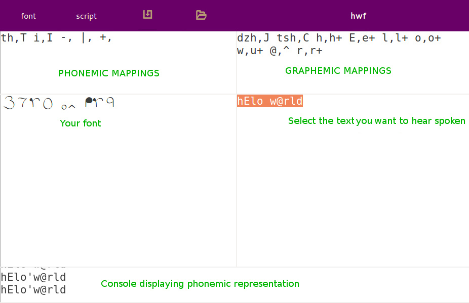

---

# Conscripting with Continua

Dan Nielsen 4/2019

---

## Introduction to Continua

If you've long wanted a computer font for your constructed script but never wanted to deal with the painstaking process of creating one, or if your script needed more flexibility than you could manage with font tools, then this web app might make things much easier for you...

https://continua-247517.appspot.com/

It's very much a work in progress, created for free, and there's no support or guarantee of it working for you, but this document will give a quick run-down of the process.

<iframe width="560" height="315" src="https://www.youtube.com/embed/SOl6ALC8QMk" frameborder="0" allow="accelerometer; autoplay; encrypted-media; gyroscope; picture-in-picture" allowfullscreen></iframe>

## Create a font code

Basically the idea is that you make your font using a code (which is mostly based on Gary Shannon's old Glyphmaker format, with tweaks).

Each line in the text area represents the code for a different character. The character you are currently defining appears in the lower right-hand area.

The code **a2k** would draw a curve of type **2** from point **a** to point **k**.

The code **a2k7w** would draw the same curve, but then connect it to point **w** with a curve of type **7**.

The code **a2kd7w** would draw two curves: **a2k** and **d7w**.

The slash **/** represents a straight line, so **a/k** is a line from **a** to **k**.

There are ten curves from **0** to **9**.

To reach spaces in between the main grid points, use **-** (half-step right), **|** (half-step down), and **+** (half-step right and down).

Prefixing the line with the spacing characters, will set the advance distance (how much space is advanced when that character is typed).

Other prefix characters are **@** and **\*** - these can be used to correct tracing defects caused, for example, by added holes or separated glyphs.

Also, **^** can be used to nudge a glyph upward, and **>** can nudge it to the right.

## Generate the font file

When you have completed making your font code, click the **download svg** icon at the top of the screen.

Actually, your work will be lost if you refresh or close your browser, therefore it's a good idea to make backups by clicking that download button as often as you like.

You'll receive an **SVG** file. This file will contain a font traced from the font code you defined.

Inside the comment elements of the file, the rest of your Continua data is also stored. Therefore this file contains everything you need to restore your Continua session.

To open such **SVG** data files in Continua, use the **upload continua svg** icon at the top of the screen.

Once you've uploaded the **SVG**, the **download otf** icon should appear after some seconds

## Type in your font

Now your font should be loaded.

In the **Script** screen, type inside the bottom-right text area, and it will be displayed in the bottom-left area.

However, you will immediately notice that the characters begin appearing right on top of each other. That's because we've ignored kerning when creating the font, so we type the spacing ourself.

There are three special characters for spacing. They are **-** (mini-space), **|** (half-space), and **+** (full space).

## Phoneme and grapheme maps

Continua will perform replacements on the entered text.

Replacements take the form of **\<first string\>,\<second string\>**. The second string can be empty, meaning the text will be removed. Notice also there is no space after the comma.

Phonemic replacement affects how the words are spoken by the speech synthesizer. For example, the replacement **th,T i,I** means that the word **this** would be pronounced as in English. Without replacement, it would be pronounced like **t-hees**.

Graphemic replacement can be used in two primary ways. Let's say you have a combination of characters that is typically represented by a single character, for instance, **ks,x**.

Also, you might have a single character that is made up of multiple glyphs. For example, **I,\<o\>** would replace the letter **I** with a little hieroglyphic eye composed of multiple characters in Latin font.

## Remember to keep your data files

None of your work is saved on the web app. Make sure that you keep your **SVG** and **TTF** files safe on your own computer. If you finish your font, mappings, and example text, then send me the **SVG** and **TTF** files, and I'll likely add it to the list of scripts on the web app.