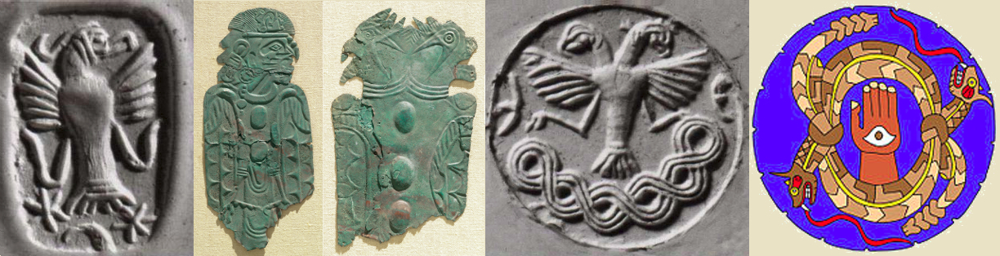

---

# Mitanni on the Mississippi?

Dan Nielsen 3/2019

## An unexpected resemblance

Indigenous people of the southeastern US spoke languages belonging to the Muskogean family. Two tribes of this group, the Choctaw and the Chickasaw, speak languages today so closely related that they are sometimes referred to singularly as Chocasaw. Together these people spanned much of the region that is now Mississippi, Alabama, and Tennessee.

Years ago, I discovered a Choctaw language guide in my local library, first learning that the proper way to write and say Choctaw is "Chahta" - so that's what we'll use going forward. But something else was surprising! The language possesses some features also distinctive to India's Hindi language, although it's spoken on the other side of the world, and there's been negilible contact between the cultures.

These features include...

* Nasalized vowels

* Frequent aspiration (*h* sounds)

* Some seemingly optional schwa sounds

Further, the standard Hindi script seemed to be a convenient way to write Chahta words.

But what really piqued my interest was the similarity of some of the most basic words in modern Chahta with ancient Sanskrit - maybe even with early Vedic Sanskrit!

## Some basic words

#### (*~* indicates nasalization)

| Modern Chahta  | Sanskrit             | English                     | Description                                                                   |
| -------------: | :------------------- | :-------------------------- | :---------------------------------------------------------------------------- |
| aa~            | aa~                  | yes                         |                                                                               |
| okala          | oka / kula           | tribe                       | Skt. "house" / "community"; compare Rus. *okala* (lit. "about the circle")    |
| achukmah       | achchah emah         | good                        | Skt. "good way"                                                               |
| kataa          | kataraa              | who? / which?               |                                                                               |
| naanta         | naama tat            | what?                       | Skt. "name that" (*naama* is indeclinable)                                    |
| katimah        | kutrah emah          | where?                      | Skt. "where is the way?"                                                      |
| katimiho~      | kimartha~            | why?                        |                                                                               |
| katiomit       | kathaa ime           | how?                        | Skt. "how are those things?"                                                  |
| katome         | kati ime / kadaa ime | how many? / when?           | Skt. "how many are those?" / "when are those?"; compare Hbs. *kada ima* ("when is it / is had?") |
| iksho          | akshunna / shunya    | zero                        | Skt. "unperturbed" / "emptiness"                                              |
| achafa         | aikah                | one                         | Skt. Vedic                                                                    |
| tuklo          | dvau                 | two                         | -o is the proto-Indo-European dual                                            |
| tuchina        | tratiya              | three                       | Skt. "third"                                                                  |
| chakaali       | chatvaari            | four                        | Cho. "nine, one hand plus four" (base 5)                                      |
| pokoli         | pa~chami             | five                        | Skt. "fifth"; Cho. "ten, one hand plus five" (base 5)                         |
| sah / siah     | soham                | I am                        | Skt. from *sah-ham* ("I am that", *hamsa*); compare Sp. *si* from *so-ke* ("I am here") |
| samanta        | samanta              | peace                       | Skt. "universal, neighboring"                                                 |
| iklanna        | ekaayana             | centered                    |                                                                               |
| siitaa         | siitaa               | harvest                     | Cho. "harvest bundle"; Skt. "harvest goddess, furrow"                         |

## Affixes

The Skt. ending vowel + *ime* appears to become *ome* in Chahta, meaning "it is so"; for instance, we might interpret *katomit* as "how is it so?". Might *ome* relate to Skt. *auu~*?

We might also look at prefixes. One of the best-known Sanskrit prefixes is *anu*, meaning "following along and according with, with respect to". On searching Byington's dictionary, we find that the Chahta have a similarly used morpheme:

> *ano*, *aano*, rel. pro. in the obj. case, used after adj. and verb, subj. *ato*; the which; the one which; that which; see *a~*. It differs from a rel. pro. It appears to be used to give more distinction of object and is more sonorous and appears often in solemn style; *ano*, *hano*, *yano*, *kano* are often heard in the speech of a Choctaw orator. The last syllable is accented.

> *anoa*, *annoa*, *annoa*, *annowa*, pp., declared; described; designated; detailed; enunciated; famed; stated, Matt. 9:26; told; related; reported; proclaimed; noised abroad, Luke 1:65; rumored; informed; posted; mentioned; narrated; noised; published; reported; revealed...

> *anoa*, *annoa*, *anowa*, n., a narration; a report; a rumor; fame, Josh. 9:9; information; imanoa, a citation; a relation; renown; tidings, 1 Sam. 4:19...

> *anoa*, *annowa*, *annoa*, a., famous; noted; notable; illustrious; known, Matt. 10: 26. 

> *anoa*, *annowa*, v. n., to be famous; to be noted; to be well known; annoho~wa, freq., to be often told, Matt. 14:1.

> *anoa*, adv., again; once more.

## The Alabama and Koasati

The Chahta and Chickasaw languages are closely related to the languages of the Alabama, Koasati, Mikasuki, and now-lost Hitchiti, formerly neighboring tribes. On opening an Alabama dictionary to just the first page of words beginning with A, more candidates appear.

| Modern Alabama | Sanskrit             | English                     | Description                                                                   |
| -------------: | :------------------- | :-------------------------- | :---------------------------------------------------------------------------- |
| aabaachi       | abbaaji              | teacher                     | Skt. "respected father"                                                       |
| aaboli         | bolayati             | wash                        | Skt. "to plunge into water and emerge again"                                  |
| aamatka        | amata                | scatter                     | Skt. "dust, death, time"                                                      |
| aapakha        | paksha               | shoulder blade              | Skt. "wing"                                                                   |
| aapihchi       | pichinda             | body                        | Skt. "body part"                                                              |
| aapita         | pita                 | basket                      | Ala. "to put into enclosed space"                                             |
| aaholponi      | holnaa paani         | cooking pot                 | Skt. "cooking pot of water"                                                   |
| pahni          | paani                | water                       | Ala. "creek, stream, bayou"                                                   |
| achaaki        | aachake              | love                        | Ala. "to accompany, date"                                                     |

Imagine if we were to search the whole dictionary! By using glossaries and language guides for the Chahta, Chickasaw, Alabama, and Koasati together, there's a lot we might find out about early Sanskrit, and a lot we might come to know about how these tribes viewed themselves, each other, and the world around them.

## The Mitanni

Keep in mind, there are thousands of years between our records of these languages. Even if there had somehow once been a connection, one would think any distinguishing features would have been lost in the woodland communities without writing, along with hundreds of years of European immigration - after deaths, dissolution, reeducation, and relocation.

But were we able to establish a connection between the languages, we might have a framework allowing us to turn back the clock on some of the language developments in Chahta, to restore and record pieces of an earlier version. At the same time, we might even learn some new things about Vedic Sanskrit.

The apparent likeness must be a coincidence or an example of parallel thinking in language development. After all, deciding otherwise would require that Sanskrit passed through China, crossed the Bering Strait, and then trekked to the other side of North America - all without leaving a trace along the way.

But then I learned about the Mitanni. They were speakers of Vedic Sanskrit who followed Vedic practices and lived in the fertile crescent, ruling the Hurrians from c. 1475-1275 BC, who continued to speak the Hurrian language. The Phoenicians, also in their domain, were allowed independent government. A hundred years later - as the neighboring Egyptian and Hittite kingdoms weakened, and their own sailing design advanced - the Phoenicians became masters of the sea.

A question arises: In the years following the fall of the Mitanni kingdom, might some of the regions' former elite have traveled on expeditions of trade, refuge, or exploration that eventually reached the New World?

## Unique symbols

Mississippian artifacts (c. 1300 AD) found in Missouri and Alabama, and Hittite seals (in gray tone, c. 1800 BC)

In addition to words, there were also strikingly similar features of the symbology used in both regions. While many are not unique and have arisen the world over - such as horned snakes, whorled crosses, maces, petaled portals - others are more distinctive.

The two-headed bird of prey seen above is strongly associated with Hittite culture. It does not make another major reappearance in the Old World until the emergence of the Byzantine empire. That this symbol should widely appear in the New World is compelling.

The eye-in-hand is another distinctive symbol associated with the Vedic and Semitic notions of *soham*, or *hamsa* (*hamesh*).

## Questions

If Vedic/Hittite/Hurrian/Phoenician culture reached the New World, and it was successful enough to spread a spoken language, there should be some other distictive marks to be found.

Questions begin to rain: Why don't we find images of horses, ships, and chariots? metal smelting? written language? Old World DNA? Why didn't they return to the Old World?

Some responses come to mind...

* If someone has never seen a horse, a drawn horse would not have immutable distinguishing characteristics, such as extra legs or eyes, that would identify and preserve it from mutation, and lend itself to future identification by excavators

* Some scholars, such as Dr. Yvette Collin, insist that horses already existed in the New World when Spanish settlers arrived

* Chariots do not matter to a people who live in wooded hills without domesticated horses

* Although indigenous North Americans were certainly capable of smelting metal (as found in South and Central America), it seems they chose not to for spiritual reasons

* It seems reasonable to think that many of the skills for writing, mining, metallurgy, large-ship building, etc. were not possessed by many of the original explorers, or they were not of primary importance in this new place and with this people at that time - and therefore not learned by a new generation

## X marks the spot?

If this immigration occurred, the settlers likely produced enough offspring to be identifiable through genetic traces. We don't know which ethnicity from the Old World would have been spread, but a genetic marker should be introduced to the New World c. 1200 BC (the Bronze Age collapse).

The map below shows the *X* haplotype, a signal that appears in the population of indigenous North Americans, but which does not appear in the far eastern reaches of Asia. In fact, it centers on the fertile crescent. The Druze are most identified with this haplotype. In the New World, we find it centered on the Great Lakes. I'd suggest that the Trail of Tears produced the bulge you see in eastern Oklahoma, along with the vacancy seen in the Southeast. Many native Americans moved northward toward Canada during the wars of America and Europe.

Addendum: Since the time of this writing, announcement was made that Mitanni tablets have been excavated from a submerged palace - will be interesting to see what is made of them