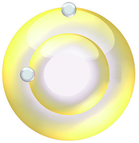

---

# Seeing Sonance

Dan Nielsen 3/2019

---

## Harmonic height

A simple musical interval can be written as a ratio of two vibrations. For example, **3 : 2** (or **3 / 2**) means that one waveform vibrates three times for every two vibrations of the other. This is known as interval ***width***. The interval in this example is called the perfect fifth.

The interval **2 : 1** represents the octave, and it is often factored out due to the idea of "octave equivalence". In this way we assume that all pitches essentially occur within the same octave. Of course, that isn't true in reality - for instance, a clashing minor second sounds less dissonant when one note is played in a different octave from the other. However, the doctrine of octave equivalence is a very useful baseline for constructing progressions of filled-out harmonies, getting instruments playing in tune together, and other such practicalities. Also, there's a certain warmth when notes are bunched up together inside an octave like a happy family, at least when the pitches are getting along.

It also simplifies our math. You can consider this similar to the question in mathematics of whether **1** should be considered a prime number. Mathematicians have decided no. In music, the question is whether **2** should be a significant prime number. Music theorists have also decided no.

Oftentimes we use the base-two logarithm, **lg ( *a / b* )**, as a measure of width. That is how the keys are arranged on a piano, for instance, stepping by equal log-widths. Notice that this will keep the same ranking as **( *a / b* )** for all the intervals, since, when ***x*** increases, **lg *x*** also always increases.

Now let's consider the dissonance of an interval. Music theorists sometimes call this the chord's ***height***. Low height is considered calm, stable, and unobtrusive. Whether it's a good term or not, let's follow suit here.

The height is defined by an extremely simple expression. For an interval ratio ***a* : *b***, it is simply the multiple ***a b***. But *why* should such a simple expression work?! *Does* it in fact work?!

There *are* some caveats. Firstly, the ratio must be expressed in reduced form within an octave. For instance, you'd write the perfect fifth as **3 : 2**, not **15 : 10**. And you write **7 : 4**, not **7 : 2**, since that would span more than an octave. Secondly, this only works for relatively low values of ***a b***. That's because our hearing, for the most part, will simplify matters, interpretting something like **301 : 200** as **3 : 2**. This is especially true when we consider that sound waves are usually messy and inconsistent things, not perfect sinusoids.

As with width, oftentimes we use the base-two logarithm, **lg *a b***, as a measure of height.

Triads can be expressed like **1 : 3 : 5**. In this example, **1** is the tonic, **3** is the third harmonic (a perfect fifth up), and **5** is the fifth harmonic (a major third above the tonic, assuming octave equivalence). We compute the height of ***a* : *b* : *c*** as **lg *a b c***. Therefore the value is **lg 15**.

For comparison, consider the chord **3 : 5 : 9**. An example of this chord is **G E D**. The chord's height is **lg 135**, a much higher value.

## The usual explanation

A typical derivation of height might go as follows...

Each prime factor in a reduced ratio represents a different dimension in tonal space. That's because, as far as mathematical ideals are concerned, no power of a prime number will ever equal a power of a different prime number. As an example, **5 *m*** never can equal **7 *n***, no matter which integers we choose for ***m*** and ***n***. We can say that those axes are independent.

Take the number **45**, for instance, which has prime factors **3 \* 3 \* 5**, or **3 2 5**. What this tells us is that **45** is located **2** units along the **3**-axis, and **1** unit along the **5**-axis.

But what does it mean to multiply numbers in this context? When we go to the store, we walk two blocks east, and then add one block north. We don't multiply.

Remember how I mentioned we often take the logarithm of height? That's one reason why - the logarithm **lg *x y*** = **lg *x*** + **lg *y***.

When we normally compute distance, we use the formula **sqrt ( *x* 2 + *y* 2 )**. Your trip to the store, however, was not a straight line - you had to follow the sidewalks, so it was three blocks. That's the first-order, or taxicab, distance.

In our neighborhood, however, the blocks are not square - they're rectangular. Each block along the **3**-axis is length **lg 3**. Each block along the **5**-axis is length **lg 5**. In general, the length of a block along any ***n***-axis would be **lg *n***. That makes some amount of sense - higher prime numbers should contribute more height, since they are more "confusing" to the ear.

Now let's put this all together. We walk two units along the **3**-axis. That's **2 lg 3**. Then we add the distance of one block along the **5**-axis, giving in total **2 lg 3 + lg 5**.

In arithmetic, we'd say **lg 45** = **lg (3 \* 3 \* 5)** = **lg 3 + lg 3 + lg 5** = **2 lg 3 + lg 5**.

A denominator takes the form ***x* -1**. For our example, **45 -1** has all of the negative prime powers that **45** does. In other words, it represents our *return* trip from the store. The denominator gives negative travel along the axes.

In terms of complexity, however, the denominator contributes to the height in the same way that the numerator does - just as our return trip from the store took work - therefore we add it. For ***a* / *b***, we say the height is **lg *a* + lg *b* = lg *a* *b***.

In this explanation, we used a two-dimensional example, but in general our "blocks" might be of any number of dimensions. However, as mentioned earlier, high numbers are often considered approximations of lower numbers by our ears.

Four-dimensional basis with axes of prime factors **3**, **5**, **7**, and **11** (J Monzo)

## Harmony as easy as A plus B?

That's not a bad explanation, but it leaves questions in its wake...

* Why did we use the taxicab (first order) distance?

* How do we know that our block lengths are correct?

* Are all the results right?

Let's try out a different metric, the **norm** function **sqrt ( *a* 2 + *b* 2 )**. This is how we measure distance in the usual, physical world. We can ignore **lg** and **sqrt** functions in our comparison of interval rankings, since those functions are monotonic (produce the same ordering). And we will only consider intervals within the octave, since those are the ones supported by the conventional notion of height.

| *a* *b*    | *a* 2 + *b* 2 |
| ---------: | :---------------------------------- |
| 1/1        | 1/1                                 |
| 2/1        | 2/1                                 |
| 3/2        | 3/2                                 |
| 4/3        | 4/3                                 |
| 5/3        | 5/3                                 |
| 5/4        | 5/4                                 |
| ***7/4***  | ***6/5***                           |
| ***6/5***  | ***7/4***                           |
| 7/5        | 7/5                                 |
| ***8/5***  | ***7/6***                           |
| ***7/6***  | ***8/5***                           |
| 9/5        | 9/5                                 |
| 8/7        | 8/7                                 |
| 9/7        | 9/7                                 |
| ***11/6*** | ***9/8***                           |
| 10/7       | 10/7                                |
| ***9/8***  | ***11/6***                          |
| 11/7       | 11/7                                |
| ***11/8*** | ***10/9***                          |
| ***13/7*** | ***11/8***                          |
| ***10/9*** | ***11/9***                          |
| ***11/9*** | ***13/7***                          |
| ***13/8*** | ***11/10***                         |
| ***11/10***| ***13/8***                          |

So, is **6 / 5** or **7 / 4** more dissonant? **6 / 5** is simply the minor third, while **7 / 4** is the harmonic minor seventh. Most would probably agree, then that **6 / 5** sounds more consonant.

How about between **7 / 6** and **8 / 5**? **7 / 6** is the septimal minor third, and **8 / 5** is the minor sixth. That's a bit of a toss-up - even though **7 / 6** contains **7** and lies between piano keys, it still produces a great sound. As Wikipedia notes, "It has a darker but generally pleasing character when compared to the **6 / 5** third". That might explain why the minor third is considered such a first-class citizen in Western music. Notice that ***a* + *b*** would yield equal values for these two intervals, since **8 + 5 = 7 + 6**.

These results seem to suggest that the **norm** performs pretty well.

What we actually used was the **2-norm**, which can be generalized to the ***p*-norm = ( *a* *p* + *b* *p* ) 1/*p***.

If we had used the **1-norm** instead, meaning ***a* + *b***, we would have obtained exactly the same ordering for these intervals (except for "ties"), as shown below. Had we used the **3-norm**, only the intervals **13 / 7** and **11 / 10** would have swapped places. As we increase the **norm** order ***p***, very slowly the intervals change place, but not much. At the **5-norm**, all the listed intervals have become sorted, firstly by numerator and secondarily by denominator - that's an effect of high ***p***. Were we to continue on toward the **infinity-norm**, the intervals would not change ranking, since they are already sorted.

| 1 | 2 | 3 | 4 | 5 | 6 | 
| :--: | :--: | :--: | :--: | :--: | :--: |
1/1 | 1/1 | 1/1 | 1/1 | 1/1 | 1/1 |
2/1 | 2/1 | 2/1 | 2/1 | 2/1 | 2/1 |
3/2 | 3/2 | 3/2 | 3/2 | 3/2 | 3/2 |
4/3 | 4/3 | 4/3 | 4/3 | 4/3 | 4/3 |
5/3 | 5/3 | 5/3 | 5/3 | 5/3 | 5/3 |
5/4 | 5/4 | 5/4 | 5/4 | 5/4 | 5/4 |
6/5 | 6/5 | 6/5 | 6/5 | 6/5 | 6/5 |
7/4 | 7/4 | 7/4 | 7/4 | 7/4 | 7/4 |
7/5 | 7/5 | 7/5 | 7/5 | 7/5 | 7/5 |
7/6 | 7/6 | 7/6 | 7/6 | 7/6 | 7/6 |
8/5 | 8/5 | 8/5 | 8/5 | 8/5 | 8/5 |
9/5 | 9/5 | ***9/5*** | ***8/7*** | 8/7 | 8/7 |
8/7 | 8/7 | ***8/7*** | ***9/5*** | 9/5 | 9/5 |
9/7 | 9/7 | 9/7 | 9/7 | 9/7 | 9/7 |
9/8 | 9/8 | 9/8 | 9/8 | 9/8 | 9/8 |
10/7 | 10/7 | 10/7 | 10/7 | 10/7 | 10/7 |
11/6 | 11/6 | 11/6 | ***11/6*** | ***10/9*** | 10/9 |
11/7 | 11/7 | ***11/7*** | ***10/9*** | ***11/6*** | 11/6 |
10/9 | 10/9 | ***10/9*** | ***11/7*** | 11/7 | 11/7 |
11/8 | 11/8 | 11/8 | 11/8 | 11/8 | 11/8 |
11/9 | 11/9 | 11/9 | 11/9 | 11/9 | 11/9 |
13/7 | ***13/7*** | ***11/10*** | 11/10 | 11/10 | 11/10 |
11/10 | ***11/10*** | ***13/7*** | 13/7 | 13/7 | 13/7 |
13/8 | 13/8 | 13/8 | 13/8 | 13/8 | 13/8 |

The above table was produced with this Python program...

    r=[[1,1],[2,1],[3,2],[4,3],[5,3],[5,4],[6,5],[7,4],[7,5],[7,6],[8,5],[8,7],[9,5],[9,7],[9,8],[10,7],[10,9],[11,6],[11,7],[11,8],[11,9],[11,10],[13,7],[13,8],[13,9],[13,10],[13,11],[13,12]]
    for i in range(len(r)):
      for p in range(1,7): r.sort(key=lambda x: x[0]**p + x[1]**p); print('%d/%d |' % (r[i][0],r[i][1])),
      print

Notice that...

**norm*p* ( *a*, *b* ) norm-*p* ( *a*, *b* )**

**= ( *a* *p* + *b* *p* ) 1/*p* ( *a* -*p* + *b* -*p* ) -1/*p***

**= ( ( *a* *p* + *b* *p* ) / ( *a* -*p* + *b* -*p* ) ) 1/*p***

**= ( ( *a* *p* + *b* *p* ) / ( ( *a* *p* + *b* *p* ) / ( *a* *b* ) *p* ) ) 1/*p***

**= *a* *b***

In other words...

**( *a* *b* ) *p* = ( *a* *p* + *b* *p* ) / ( *a* -*p* + *b* -*p* )**

Logarithmically...

***p* lg *a* *b* = lg ( *a* *p* + *b* *p* ) - lg ( *a* -*p* + *b* -*p* )**

That equation depicts a lovely relationship between the two versions of height.

## A rainbow connection

Now let's consider a fundamental formula in the physical world. Consider the case when an electron moves from an orbital with number ***a*** to an orbital of number ***b***. A certain wavelength of light is emitted or absorbed in this process. In the case of the electron moving to a lower energy orbital, the light is emitted. The wavelength of light ***L*** is given by Rydberg's equation...

***L* = 1/*b* 2 - 1/*a* 2**, where ***b* < *a***

***L* = ( *a* 2 - *b* 2 ) / ( *a b* ) 2**

***L* = ( *a* + *b* ) ( *a* - *b* ) / ( *a b* ) 2**

That expression includes verions of height **( *a* + *b* )** and **( *a* *b* ) 2**, but it also includes the factor **( *a* - *b* )**.

What might we hope to get out of this? Well, assuming we can call this ***a*** and this ***b*** the very same ***a*** and ***b*** we use to represent an interval ratio ***a* / *b***, then we can give colors to intervals!

Of the electron state transitions that occur in a hydrogen atom, only those moving to orbital 2 emit light in the visible spectrum. These transitions are known as the Balmer series...

The colors of the transitions to orbital 2 are...

| orbital transition | color  |
| :----------------: | :----: |
| 3 to 2             | red |
| 4 to 2             | cyan |
| 5 to 2             | blue |
| 6 to 2             | violet |

After this, the colors fade out into the ultraviolet.

If we take the three strongest signals, which correspond with those ratios of the visible spectrum that are as reduced as possible (meaning 3:2 is reduced, while 6:2 is not), we could associate colors with the intervals in octave-equivalent form...

| interval ratio | interval name | color  |
| :------------: | :-----------: | :----: |
| 2 : 1          | octave        | cyan |
| 3 : 2          | perfect fifth | red |
| 5 : 4          | major third   | blue |

## Conjunction

Recall the expression...

***L* = ( *a* + *b* ) ( *a* - *b* ) / ( *a b* ) 2**

We saw earlier that **( *a* + *b* )** works as a definition for interval height.

Now to look at the second factor, **( *a* - *b* ) / ( *a b* ) 2**. What could the numerator, **( *a* - *b* )**, possibly represent?

Perhaps orbits. For instance, the planet Venus completes about **13** orbits for every **8** of Earth's orbits, meaning Earth's year is **13 / 8** that of Venus. During that time, Venus and Earth experience **5** conjunctions, when they are closest to each other. We can calculate that number as the numerator minus the denominator, or **13 - 8**. Were Venus and Earth on the same orbit path, that is how many times they would touch during **8** Earth years, or **13** Venus years.

Now let's look at the denominator **( *a b* ) 2**. Imagine two concentric spheres of radii ***a*** and ***b*** . If a particle were traveling along the surface of a sphere at a constant speed, then the probability of finding it in a given area would be inversely proportional to the square of the radius. If there were a particle on each of the two spheres, the probability of finding them in the same area would be proportional to **1 / (*a b*) 2**.

The probability of finding them in the same area when - instead of assuming random placement, we account for their periodic orbits - might be proportional to **( *a* - *b* ) / ( *a b* ) 2**.

So there's a notion - perhaps electrons really do orbit, but they're made up of two parts that can only be observed when in conjunction! Then when they are observed, it's as pulses of electromagnetic energy.

Okay, so that's just a half-formed conjecture. In any case, the interesting thing to me is that matter, light, and sound seem to share some fundamental and simple - though still somewhat mysterious - connections.