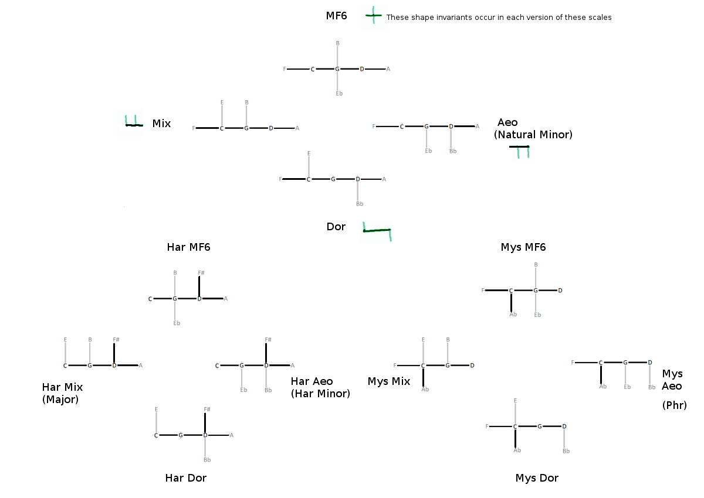

---

# The Structure of Scales

Dan Nielsen 3/2019

---

### (The next article in this series is [Chord Cartography](http://wfo.conlang.org/malkachi/chord-cartography))

## Four scales

The harmonic duo called major and minor have predominated in Western music since the 16th century. When hanging out with other modes of the diatonic scale, they go by the names Ionian and Aeolian.

It's easy enough to see why they have been paid such dues, when we consider the significance placed upon the major V and diminished vii triads in analysis of this music. We can express the notes of both triads by the dominant-7 chord. Assuming that important, a major triad underpinning a Dom7 chord basically spells out the major scale. Likewise, placing a Dom7 upon a minor triad practically gives the harmonic minor scale. Additionally, the major I shares two tones with both its own relative and absolute minor triads.

But these are *not* the only pair of scales to act as progenitors of harmony, I'd argue. There are two other scales that show an incredible symmetry both within themselves and with each other. By understanding their role, we can come to a much better understanding of harmony in general.

The two I mention are known as the Dorian scale and the Mixolydian Flat 6 (which we'll write MF6). Here they are as played on a keyboard and rooted on G...

It's easy to remember these scales - the B-flat of the Dorian is the first flat in the cycle of fifths, while the E-flat of the MF6 is the second flat.

We immediately see some of their symmetry in the palindromic ordering of steps. Dorian is **whole - half - whole - whole - whole - half - whole**, while MF6 is **whole - whole - half - whole - half - whole - whole**.

From the viewpoint of major and minor keys, we could take Dorian to be a natural minor scale (or equivalently a descending melodic minor) with a raised 6. Likewise, we could see MF6 as the natural minor scale with a raised 3.

Let's add one more scale to fill out the set - what do we get from a natural minor scale with both a raised 3 and raised 6? That would be Mixolydian. Mixolydian is also equivalent to a major scale with a flat 7. In this way we might consider the major scale to be Mixloydian with a leading-tone 7, or - to parallel the idea of harmonic minor - we could say the major mode is "harmonic Mixolydian".

So now we've brought focus to a set of four modes: **Aeolian**, **Dorian**, **Mixolydian**, and **MF6**.

We already see a sort of symmetry there, but we're holding the telescope backward. The natural way to examine scales is through the harmonies that make them up. We will see that Dorian and MF6 are symmetric with themselves and each other by looking at the harmonies as limited to factors of three prime numbers - 3 and less, 5 and less, and 7 and less. These are the three fundamental types of harmonic analysis related to diatonic scales.

## 3-limit

Allowing only perfect fifths, we see the Dorian mode is formed by three fifths up, and three fifths down...

Bb -------- F -------- C -------- **G** -------- D -------- A -------- E

If we skip the endpoints and go another fifth in each direction, we form the MF6 scale...

Eb -------- * -------- F -------- C -------- **G** -------- D -------- A -------- * -------- B

We can snap strands into approximate rings of fifths, and then Dorian shows less distortion of the fifths than MF6...

## 7-limit

Taken as 7-limit, however, MF6 shows symmetry. We can simply play the overtones 1:2:3:4:5:6:7:8 ascending, and then the same intervals descending, to fill out a 7-limit version of this scale.

## 5-limit

Now let's look at 5-limit. In this act, we'll bring in more characters - firstly the harmonic versions of our scales, those defined by a raised seventh degree. We'll also bring in scales with the complementary operation, a lowered second - let's call it **mystic**.

These 12 seven-note scales are generated by three rules...

* **They must be built on a nucleus of one perfect fifth up, and one perfect fifth down (in other words, they are built from dominant and subdominant degrees)**

    The perfect fifth is the fundamental interval, and so we begin with the symmetric construction C -------- **G** -------- D.

* **They cannot contain two neighboring half-steps**

    It warps the scale and spoils the distribution.

* **Each new note can only be bonded to the nucleus**

    Not to other new notes, since that would make the harmony less stable.

I'd suggest that a metric for scale "brightness" might be given by taking the number of harmonic "prongs" pointing upward in the figure above, minus the number pointing downward. We should also probably weight these prongs, maybe like so: prongs attached to tonic have more influence than those attached to the fifths.

However, that's not quite right. The note B (the major thrid) attached to tonic G does seem to have more influence on brightness than an F# (the leading tone) attached to D, or an E (the major sixth) attached to C. After all, the third traditionally determines whether we are in a major or minor key, while the harmonic minor scale ascending has both major sixth and major seventh degrees. In this case, then, we might divide by the pitch value to which the prong is attached, so that a prong attached to the tonic is +1/(1/1) = +1, and a prong attached to a fifth is +1/(3/2) = +2/3. Let's multiply by three to say +3 and +2.

But the same does not seem to be true for downward prongs. The note Eb (the minor sixth) attached to G has less darkening influence than a Bb (the minor third) attached to D, or an Ab (the minor second) attached to C. So in the case of downward prongs, let's say that prongs attached to fifths are -3 and prongs attached to tonic are -2.

For example, harmonic minor (HarAeo) has one prong up on D and two prongs downward, one from G and one from D, so we get +3-2-3 = -2. Therefore it is considered a dark scale (less than zero).

Oftentimes a triangular lattice is used to represent 5-limit harmony, meaning we also bind across the minor third (6/5). You can see that more symmetries are brought out by this representation...

## Secret passages

You might notice that Har MF6 and Mys Mix have the same structure (but with a different placement about tonic). That's also true of Mys MF6 and Har Aeo.

So, if we were, say, playing in Har MF6 rooted on G, and then we emphasized D (the dominant) as the root, we would automatically move the scale into D Mys Mix.

Likewise, if we were playing in G Har Aeo, and then we emphasized D as root, we would then be in D Mys MF6.

Those transistions would have also worked in reverse (moving to the subdominant).

This is exactly where it is most useful to have this ability - between the scales that are least alike, the harmonic and the mystic.

In the future, I might refer to this harmonic phenomenon as "tonic floating".

## Coda code

Here's a Python program that validates the 12 scales as generated by the previously mentioned rules. It produces them while assuming 12 notes per octave, and then again while assuming 19 notes per octave...

    edoNote={
      12 : ['G','Ab','A','Bb','B','C','Undef','D','Eb','E','F','F#'],
      19 : ['G','G#','Ab','A','A#','Bb','B','B#','C','C#','Db','D','D#','Eb','E','E#','F','F#','Gb'],
    }
    ministepsToMysticSecond={
      12 : 1,
      19 : 2,
    }
    def comb(m,lst):
      if m==0: return [[]]
      return [[x]+suffix for i,x in enumerate(lst)
        for suffix in comb(m-1,lst[i+1:])]
    def diff(v,i1,i2):
      return abs(v[i1%len(v)]-v[i2%len(v)])
    def printScales(edo, nucleus, numNotesToChoose, possibleNotesToChooseFrom):
      note=edoNote[edo]
      steps=ministepsToMysticSecond[edo]
      nucleus=map(lambda s:note.index(s),nucleus.split(' '))
      possibleNotesToChooseFrom=map(lambda s:note.index(s),possibleNotesToChooseFrom.split(' '))
      com=comb(numNotesToChoose,possibleNotesToChooseFrom)
      r=[]
      n=0
      print "Of %d possible combinations..." % len(com)
      for v in com:
        v+=nucleus
        v.sort()
        neighboringHalfsteps=False
        for i in range(len(v)):
          if (diff(v,i,i+1)<=steps or diff(v,i,i+1)>=edo-steps) and (diff(v,i+1,i+2)<=steps or diff(v,i+1,i+2)>=edo-steps):
            neighboringHalfsteps=True
            break
        if not neighboringHalfsteps:
          r+=[map(lambda k:note[k],v)]
      r.sort(key=lambda x:x[1]=='Ab')
      lastIndex=len(nucleus)+numNotesToChoose-1
      r.sort(key=lambda x:x[lastIndex]=='F#')
      for v in r:
        n+=1
        print n,' '.join(v),
        if v[1]=='Ab': print '- Mys',
        if v[lastIndex]=='F#': print '- Har',
        print
    printScales(12, 'G C D', 4, 'Ab A Bb B Eb E F F#')
    printScales(19, 'G C D', 4, 'Ab A Bb B Eb E F F#')
