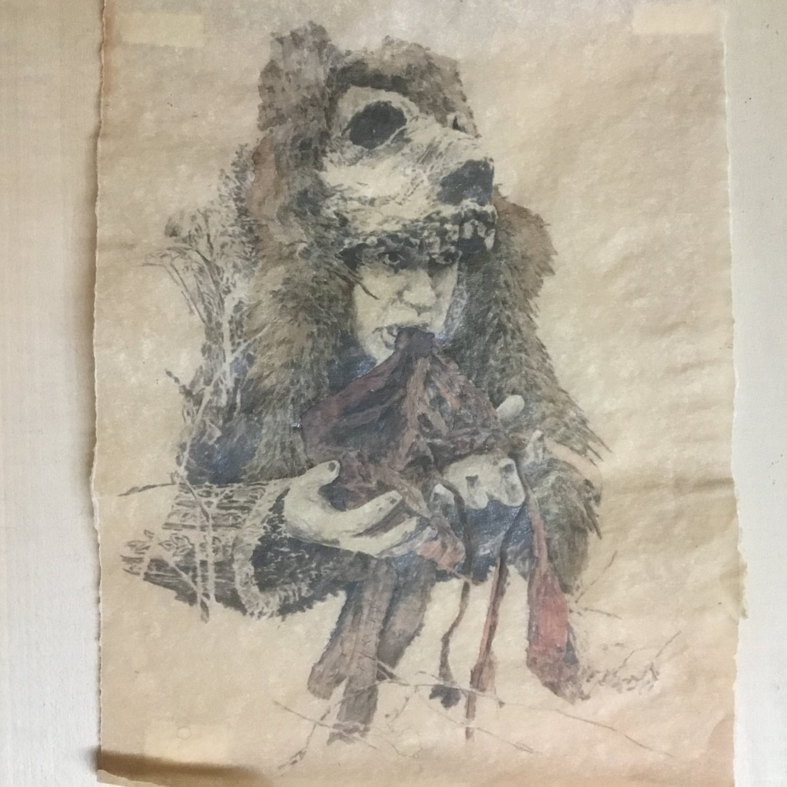
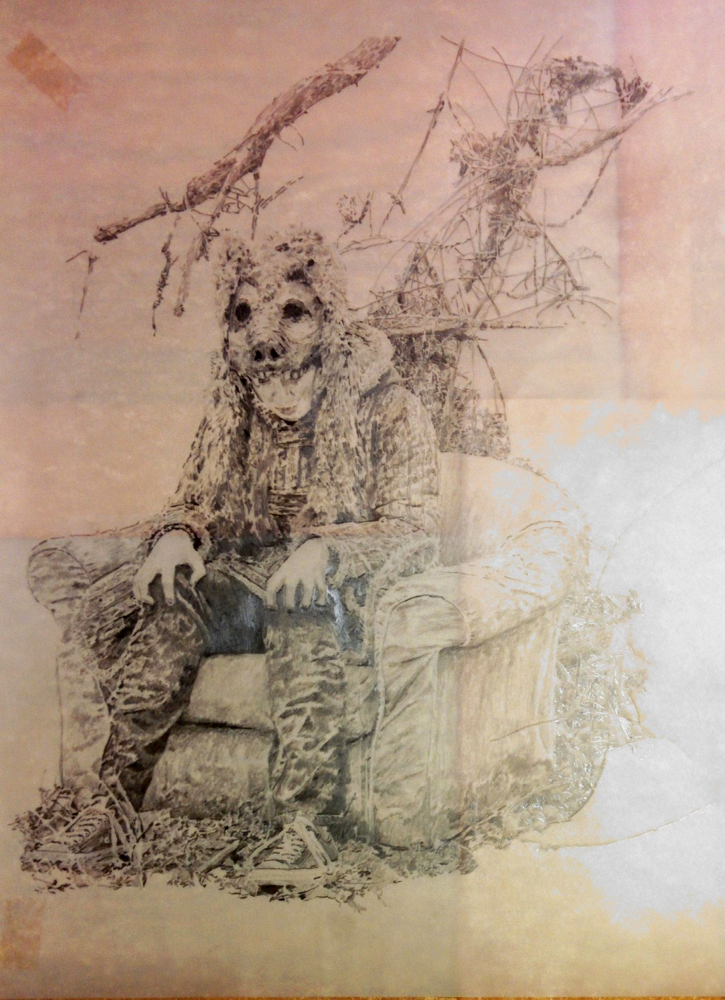

# Description of Nagku
### Cassander Garduna

Below is the character Nagku the unlearning beast, the ascetic of the dark forest, the one who vomits poison. Nagku is the personification of the wild, its magic, it beauty, its freedom and its danger. He eats and smokes atsusta (the forgetting plant) as his goal is to purify himself through unlearning, forgetting everything he knows, including language itself. Nagku was born from the things I wish i had never learned or could forget, to be unburdened by memories of the past and let the wild back in.  

    
In Nagku's early life he was refered to as Nak-Nak which in the language Nishgwi Lanta means (no no).  As an orphen Little Nak-Nak had many different care takers throughout his childhood. One such caretaker was a women named Gula se gitla hela (Gula the dog women). Nak-nak was a frail sickly child with a lung disorder. Gula tried to treat him the best she could with her minute knowledge of medicine, but only made him sicker. everyday for several years while living with Gula, Nak-nak would vomit up the bad medicine she gave him. This is one reason why as an adult Nak-nak was eventually given the name Nagku (one who vomits poison), but the poison he would expell as the unlearning beast was knowledge itself. 
    
As a young adult Nak-nak was called Tunta Ogk Sattu meaning (feels like home) he was a kind and loving young man, bright and ambitions. He studied the ancient texts of other cultures and eventually brought writing and language to the kitka tuatha (the driftwood tribe) which Sattu belonged.  Eventually he left his little island athlandrun (the beautiful place) and travel to a foreign land to study and become even more knowledgable. As a scholar Sattu was formidable, and by far the brightest of his tribe, but when he returned to athlandrun he had changed completely, no longer was he kind or friendly, no longer was he interested the development mind, but infact quite the opposite. It was then that Tunta Ogk Sattu became Nagku the unlearning beast and traveled deep into the dimma skog (the dark forest of athlandrun). There he swore to unlearn all that he had been taught. He looked to the wild animals as objects of admiration to be emulated, he smoked Atsutsa the forgetting plant, he became reclusive and wild.
    
No one but Nagku knows why this change of heart came about. Some of the tribe see Nagku as a sage or shaman, and follow his actions as sacred teachings, others pitty him, and others still follow the teachings of Tunta Ogk Sattu to this day.  Because of this Nagku is one of the most influencial Kitka of all time.